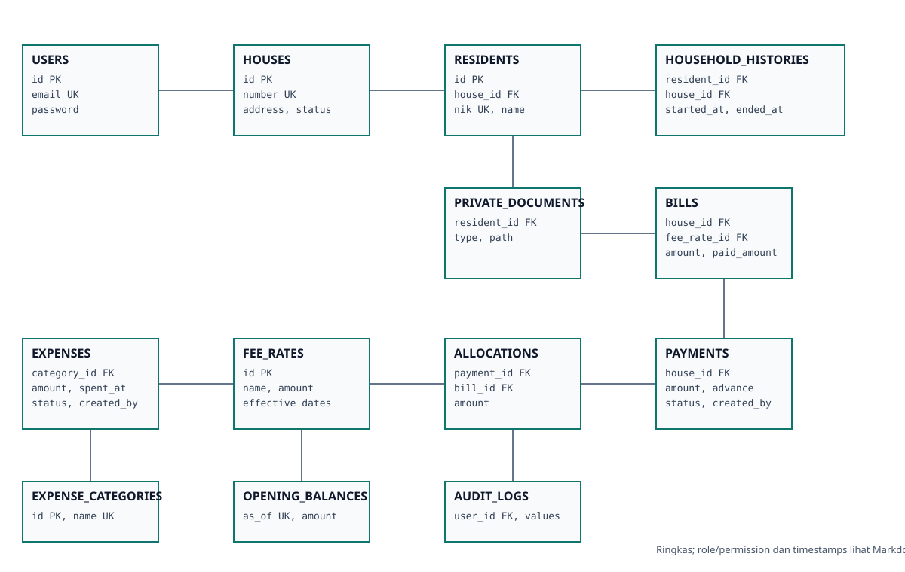

# ERD Portal Warga — Schema Aktual

Diagram berikut mengikuti migration aktual. Tabel cache, queue, session, password reset, dan token framework tidak ditampilkan agar domain utama tetap terbaca. Kolom timestamp standar juga diringkas.

```mermaid
erDiagram
    USERS {
        bigint id PK
        string name
        string email UK
        string password
        boolean active
    }

    PERMISSIONS {
        bigint id PK
        string name
        string guard_name
    }

    ROLES {
        bigint id PK
        string name
        string guard_name
    }

    MODEL_HAS_PERMISSIONS {
        bigint permission_id PK, FK
        string model_type PK
        bigint model_id PK
    }

    MODEL_HAS_ROLES {
        bigint role_id PK, FK
        string model_type PK
        bigint model_id PK
    }

    ROLE_HAS_PERMISSIONS {
        bigint permission_id PK, FK
        bigint role_id PK, FK
    }

    NOTIFICATIONS {
        string id PK
        string type
        string notifiable_type
        bigint notifiable_id
        text data
        datetime read_at
    }

    HOUSES {
        bigint id PK
        string block_code UK
        string house_number UK
        string house_code UK
        datetime deleted_at
    }

    RESIDENTS {
        bigint id PK
        string full_name
        string nik
        string gender
        string birth_place
        date birth_date
        string phone
        string email
        text address
        string marital_status
        boolean active
    }

    HOUSEHOLDS {
        bigint id PK
        bigint house_id FK
        bigint head_resident_id FK
        string occupancy_type
        date started_at
        date ended_at
        date contract_started_at
        date contract_ended_at
        boolean active
    }

    HOUSEHOLD_MEMBERS {
        bigint id PK
        bigint household_id FK
        bigint resident_id FK
        string member_role
        date joined_at
        date left_at
        boolean active
    }

    PRIVATE_DOCUMENTS {
        bigint id PK
        bigint resident_id FK
        string document_type
        string storage_path
        string original_name
        string mime_type
        bigint size_bytes
        json metadata
        bigint uploaded_by FK
    }

    FEE_RATES {
        bigint id PK
        string fee_code
        string name
        bigint amount
        date effective_from
        date effective_until
        boolean active
        bigint created_by FK
    }

    SPECIAL_BILLS {
        bigint id PK
        string special_bill_number UK
        string title
        text description
        bigint amount
        date due_date
        string target_type
        string status
        bigint created_by FK
        bigint approved_by FK
        datetime approved_at
        bigint cancelled_by FK
        datetime cancelled_at
        text cancel_reason
    }

    SPECIAL_BILL_TARGETS {
        bigint id PK
        bigint special_bill_id FK
        bigint house_id FK
    }

    SPECIAL_BILL_DOCUMENTS {
        bigint id PK
        bigint special_bill_id FK
        string storage_path
        string original_name
        string mime_type
        bigint size_bytes
        bigint uploaded_by FK
    }

    BILLS {
        bigint id PK
        bigint special_bill_id FK
        bigint house_id FK
        bigint household_id FK
        bigint fee_rate_id FK
        string fee_code
        bigint responsible_head_resident_id FK
        string house_code_snapshot
        string responsible_head_name_snapshot
        string fee_name_snapshot
        bigint amount_snapshot
        string type
        string title
        date period
        date due_date
        bigint amount
        bigint paid_amount
        string status
        json fee_snapshot
        text note
    }

    PAYMENTS {
        bigint id PK
        string transaction_number UK
        bigint house_id FK
        bigint household_id FK
        bigint payer_resident_id FK
        string payment_method
        bigint amount
        datetime paid_at
        string status
        text note
        bigint created_by FK
        bigint cancelled_by FK
        datetime cancelled_at
        text cancel_reason
        bigint replaces_payment_id FK
    }

    PAYMENT_ALLOCATIONS {
        bigint id PK
        bigint payment_id FK
        bigint bill_id FK
        bigint amount
    }

    PAYMENT_PROOFS {
        bigint id PK
        bigint payment_id FK
        string storage_path
        string original_name
        string mime_type
        bigint size_bytes
        bigint transfer_amount
        bigint uploaded_by FK
        json metadata
    }

    EXPENSE_CATEGORIES {
        bigint id PK
        string name UK
        boolean active
    }

    EXPENSES {
        bigint id PK
        string transaction_number UK
        bigint expense_category_id FK
        string title
        text description
        bigint amount
        date spent_at
        string status
        bigint created_by FK
        bigint cancelled_by FK
        datetime cancelled_at
        text cancel_reason
        bigint replaces_expense_id FK
    }

    EXPENSE_PROOFS {
        bigint id PK
        bigint expense_id FK
        string storage_path
        string original_name
        string mime_type
        bigint size_bytes
        bigint uploaded_by FK
        json metadata
    }

    OPENING_BALANCES {
        bigint id PK
        date as_of UK
        bigint amount
        text note
    }

    AUDIT_LOGS {
        bigint id PK
        bigint user_id FK
        string action
        string auditable_type
        bigint auditable_id
        json old_values
        json new_values
        json metadata
        string ip
    }

    SETTINGS {
        bigint id PK
        string key UK
        text value
        string type
        string group
        bigint updated_by FK
    }

    HOUSES ||--o{ HOUSEHOLDS : contains
    RESIDENTS ||--o{ HOUSEHOLDS : heads
    HOUSEHOLDS ||--o{ HOUSEHOLD_MEMBERS : contains
    RESIDENTS ||--o{ HOUSEHOLD_MEMBERS : joins
    RESIDENTS ||--o{ PRIVATE_DOCUMENTS : owns
    USERS o|--o{ PRIVATE_DOCUMENTS : uploads

    USERS o|--o{ FEE_RATES : creates
    HOUSES ||--o{ BILLS : receives
    HOUSEHOLDS ||--o{ BILLS : liable
    FEE_RATES o|--o{ BILLS : prices
    RESIDENTS ||--o{ BILLS : responsible
    SPECIAL_BILLS o|--o{ BILLS : generates

    SPECIAL_BILLS ||--o{ SPECIAL_BILL_TARGETS : targets
    HOUSES ||--o{ SPECIAL_BILL_TARGETS : selected
    SPECIAL_BILLS ||--o{ SPECIAL_BILL_DOCUMENTS : documents
    USERS o|--o{ SPECIAL_BILL_DOCUMENTS : uploads
    USERS o|--o{ SPECIAL_BILLS : manages

    HOUSES ||--o{ PAYMENTS : pays
    HOUSEHOLDS ||--o{ PAYMENTS : submits
    RESIDENTS ||--o{ PAYMENTS : payer
    USERS o|--o{ PAYMENTS : manages
    PAYMENTS o|--o| PAYMENTS : replaces
    PAYMENTS ||--o{ PAYMENT_ALLOCATIONS : allocates
    BILLS ||--o{ PAYMENT_ALLOCATIONS : receives
    PAYMENTS ||--o{ PAYMENT_PROOFS : proves
    USERS o|--o{ PAYMENT_PROOFS : uploads

    EXPENSE_CATEGORIES ||--o{ EXPENSES : classifies
    USERS o|--o{ EXPENSES : manages
    EXPENSES o|--o| EXPENSES : replaces
    EXPENSES ||--o{ EXPENSE_PROOFS : proves
    USERS o|--o{ EXPENSE_PROOFS : uploads

    USERS o|--o{ AUDIT_LOGS : acts
    USERS o|--o{ SETTINGS : updates
    PERMISSIONS ||--o{ MODEL_HAS_PERMISSIONS : assigned
    ROLES ||--o{ MODEL_HAS_ROLES : assigned
    PERMISSIONS ||--o{ ROLE_HAS_PERMISSIONS : granted
    ROLES ||--o{ ROLE_HAS_PERMISSIONS : has
```

## Constraint penting

- `houses` memiliki unique composite `(block_code, house_number)` dan unique `house_code`.
- `permissions` dan `roles` memiliki unique composite `(name, guard_name)`.
- `household_members` unik pada `(household_id, resident_id)`.
- `special_bill_targets` unik pada `(special_bill_id, house_id)`.
- Tagihan rutin unik pada `(house_id, fee_code, period)`; tagihan khusus unik pada `(special_bill_id, house_id)`.
- `payment_allocations` unik pada `(payment_id, bill_id)`.
- `residents.nik` nullable dan indexed, bukan unique.
- `replaces_payment_id` dan `replaces_expense_id` merupakan nullable self-reference yang unique.
- Pivot Spatie dan notification memakai relasi polymorphic; garis langsung ke `users` sengaja tidak digambar sebagai foreign key fisik.
- Tabel domain umumnya memiliki `created_at` dan `updated_at`; kolom tersebut diringkas dari entity agar diagram terbaca.

SVG ringkas tersedia melalui gambar fallback di atas. ERD diverifikasi terhadap seluruh migration aktual tanpa mengubah schema database.
