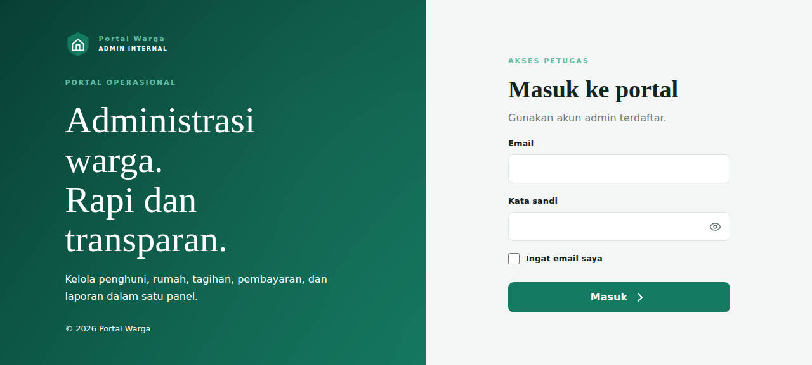
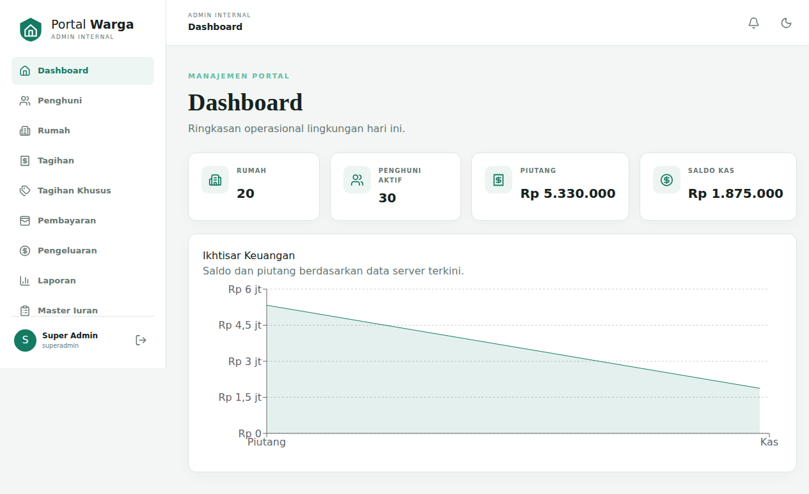
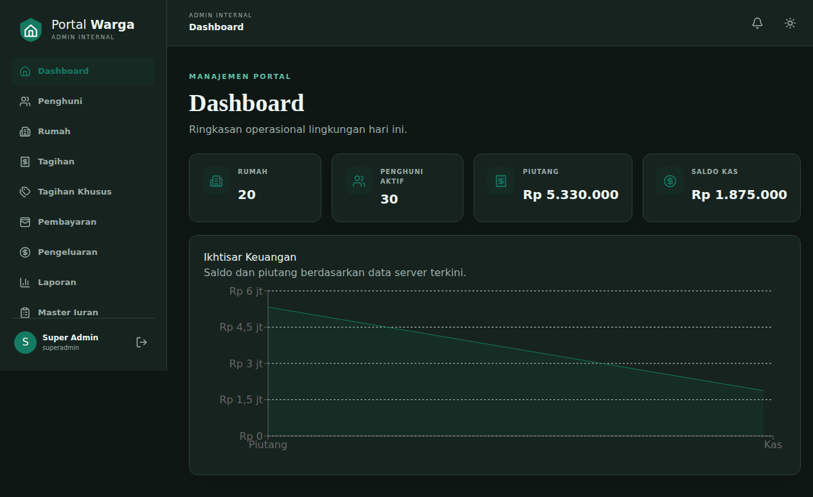
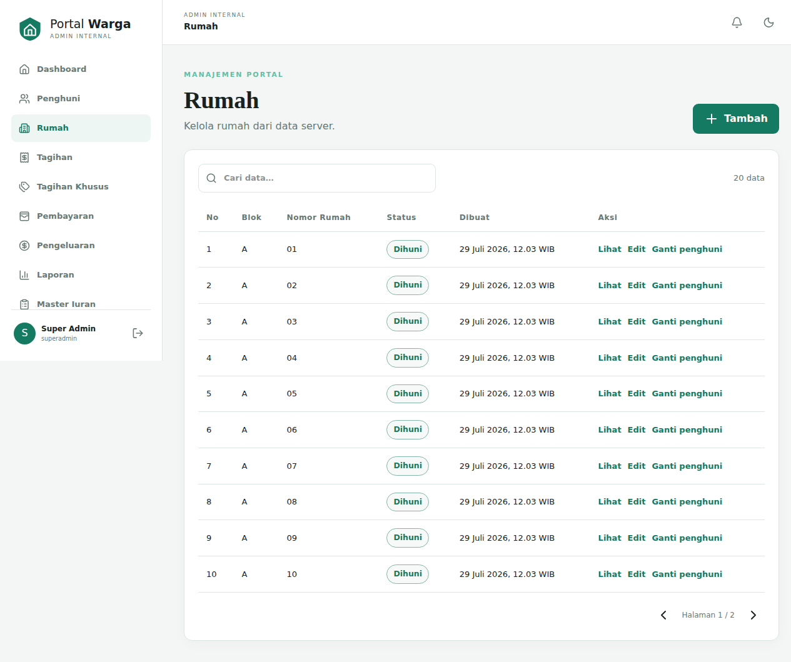
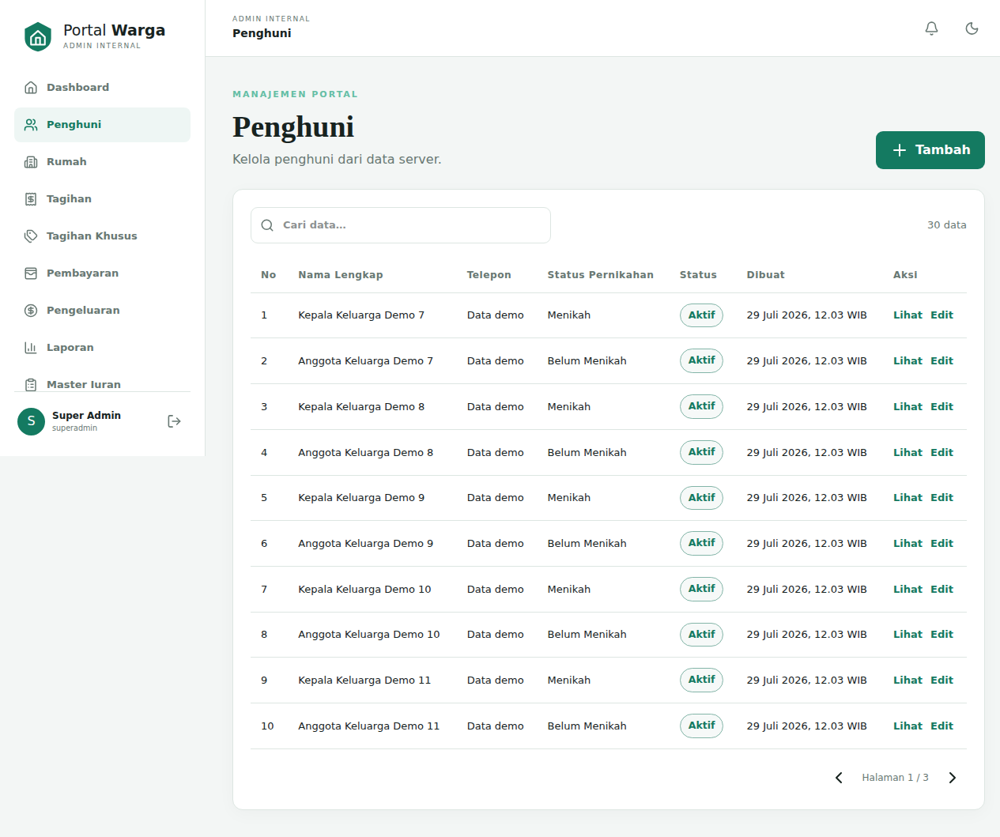
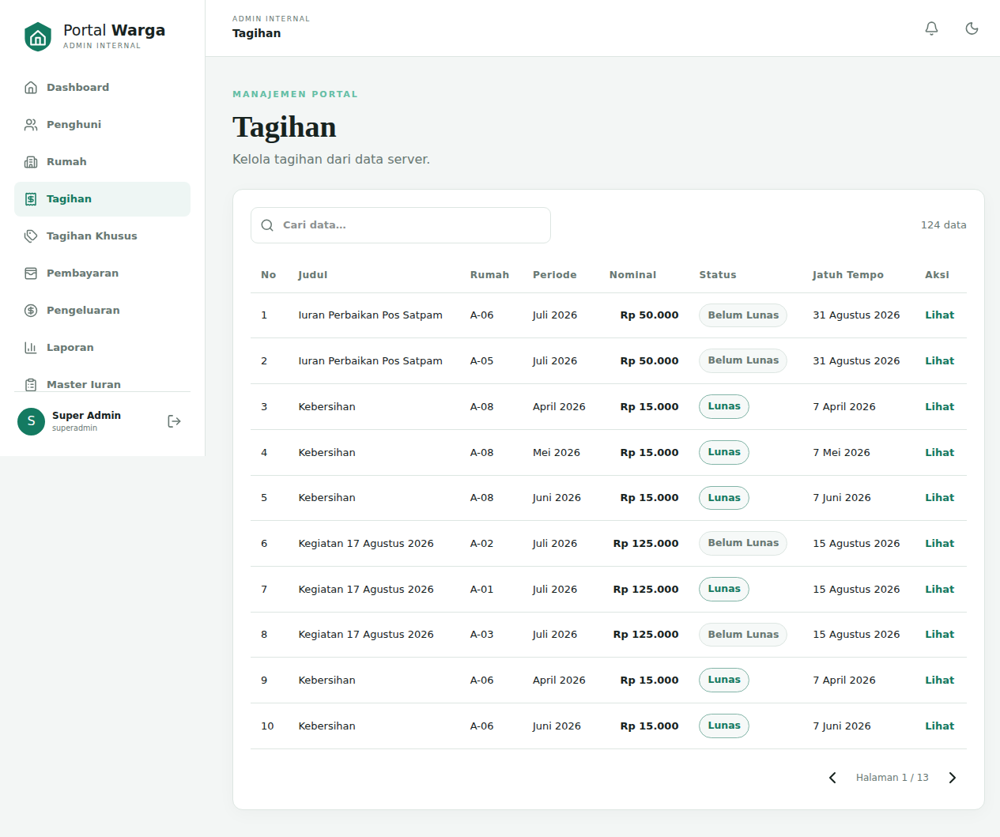
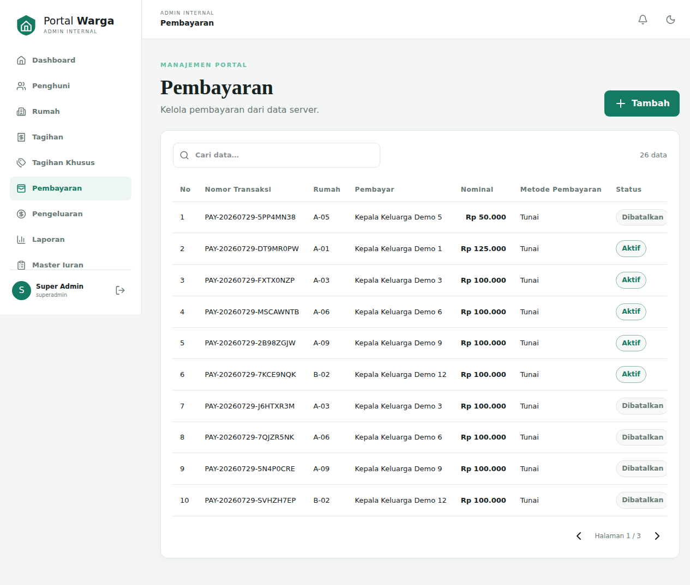
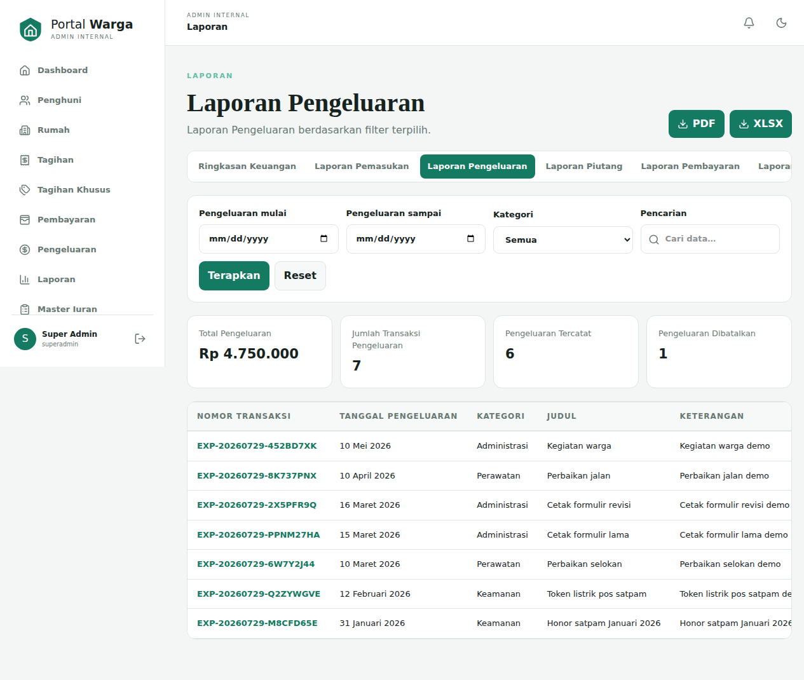
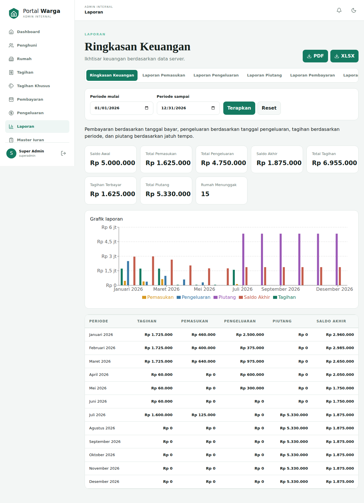

# Application Screenshots

Selected views from Portal Warga demonstrating authentication, dashboard insights, resident administration, billing, payments, expenses, and financial reporting.

> All displayed records are synthetic demonstration data prepared for technical assessment purposes.

The application includes a responsive layout reviewed during development. This gallery documents the selected desktop views only and does not claim a mobile screenshot is included.

## Login

Clean internal-administration sign-in screen with accessible labels and focused authentication flow.

## Dashboard — Light Mode

Operational summary showing houses, active residents, receivables, cash balance, and financial visualization.

## Dashboard — Dark Mode

Same operational dashboard in dark theme, preserving readable cards, chart labels, and navigation.

## Houses and Occupants

Populated house directory showing occupancy status and safe actions for viewing, editing, and occupant replacement.

## Residents

Resident directory using synthetic names. Phone values were visually masked for submission, and no identity-document details are displayed.

## Bills

Billing list with periods, house references, amounts, due dates, payment statuses, search, and pagination.

## Payments

Payment history containing synthetic payers, transaction references, amounts, methods, and lifecycle statuses.

## Expenses

Populated expense report with summary metrics, filters, export controls, categories, and synthetic transaction data.

## Financial Reports

Financial summary with date filters, export controls, summary cards, chart, and populated monthly reconciliation table.

